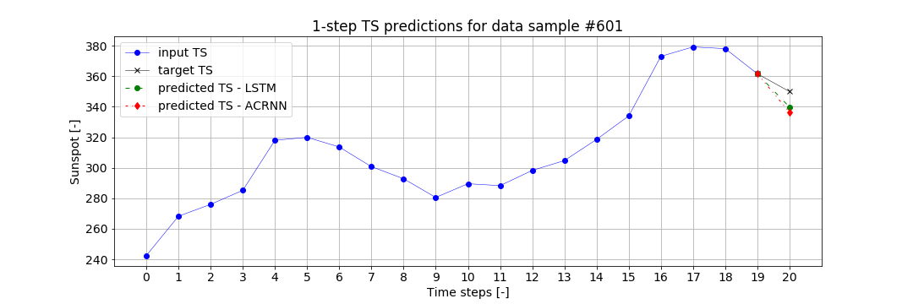

# autoregressive-conv-rnn

Implementation of the 2019 [paper](https://arxiv.org/abs/1903.02540) 'Autoregressive Convolutional Recurrent Neural Network for Univariate and Multivariate Time Series Prediction' by Matteo Maggiolo and Gerasimos Spanakis.

## 1. Datasets 
Univariate datasets for time-series (TS) forecasting:  
  * Daily minimum temperatures in Melbourne [(Source)](https://www.kaggle.com/paulbrabban/daily-minimum-temperatures-in-melbourne)  
  * Monthly sunspot number in Zurich [(Source)](https://github.com/PacktPublishing/Practical-Time-Series-Analysis/blob/master/Data%20Files/monthly-sunspot-number-zurich-17.csv)  
  
### 1.1. Data preprocessing
The authors use the following preprocessing steps:  
  * Per-variable normalization with mu=0 and sigma=1  
  * Denoising using gaussian filter of size=5 and sigma=2  
  
Denoising after normalization lead to higher standard deviation in the data such as sigma=3.8. Therefore, in order to preserve sigma=1 after denoising, the order of the preprocessing steps have been reversed in this implementation. It also lead to drastically improved MSE to the order of 10, i.e., ACRNN improved from MSE=0.2119 to MSE=0.01564 with the reversed preprocessing steps.

Implementation can be found in: [`preprocessing_temperature.ipynb`](https://github.com/dinesh-k-natarajan/autoregressive-conv-rnn/blob/main/preprocessing_temperature.ipynb), [`preprocessing_sunspot.ipynb`](https://github.com/dinesh-k-natarajan/autoregressive-conv-rnn/blob/main/preprocessing_sunspot.ipynb), [`utils/preprocess.py`](https://github.com/dinesh-k-natarajan/autoregressive-conv-rnn/blob/main/utils/preprocess.py)

### 1.2. Data windowing for time series prediction
In order to prepare the dataset for TS prediction, data windowing is necessary. The proposed model uses parallel paths with downsampled input TS to 1/2 and 1/4 of input length. Thus, the `window_size` of the input TS should be a multiple of 4.
 
The `prediction_horizon` depends on the nature of the prediction. For one-step TS predictions, a prediction horizon of 1 is used. For multi-step predictions, prediction horizons = {3,5,7} are used.

The input TS of length = 20 and the target TS of length = {1,3,5,7} form the dataset for supervised learning.

Implementation can be found in: [`preprocessing_temperature.ipynb`](https://github.com/dinesh-k-natarajan/autoregressive-conv-rnn/blob/main/preprocessing_temperature.ipynb), [`preprocessing_sunspot.ipynb`](https://github.com/dinesh-k-natarajan/autoregressive-conv-rnn/blob/main/preprocessing_sunspot.ipynb), [`utils/preprocess.py`](https://github.com/dinesh-k-natarajan/autoregressive-conv-rnn/blob/main/utils/preprocess.py)

The preprocessed and windowed datasets for TS prediction can be found in the `data/` directory in the form of `.hdf5` files.

## 2. Models

### 2.1. Simple LSTM

A baseline LSTM model is used for comparison to the proposed model. The paper does not describe the architecture of the baseline LSTM model used. In this implementation, a three-layer LSTM followed by an output layer of size `prediction_horizon` is used. 

Implementation can be found in: [`utils/models.py`](https://github.com/dinesh-k-natarajan/autoregressive-conv-rnn/blob/main/utils/models.py)

### 2.2. Autoregressive Convolutional Recurrent Neural Network (ACRNN)

The paper describes the general structure of the proposed model but not the specific architecture used to report the results.
Based on the Section 2 of the paper and improving on [this](https://github.com/KurochkinAlexey/ConvRNN) unofficial Pytorch implementation of CRNN, the proposed model has been implemented here using Tensorflow `2.4.1`.

The ACRNN model consists of three distinct parts:  
  * 3 1D (Causal) Convolutions on input TS, 1/2 downsampled TS, 1/4 downsampled TS  
  * 3 GRU layers for the outputs of the Conv1D layers  
  * Linear transformation of: (a) the outputs of the GRU layers and (b) the input TS  

The Conv1D and GRU layers represent non-linear transformation of the input TS. The output of the ACRNN model is the sum of the
non-linear part (linear transform of the concatenation of last hidden states from the 3 GRU layers) and the direct linear transformation of the flattened input TS of shape=(n_samples,n_timesteps x n_features)

Implementation can be found in: [`utils/models.py`](https://github.com/dinesh-k-natarajan/autoregressive-conv-rnn/blob/main/utils/models.py)

## 3. Experiments

TWo models were trained and evaluated for one-step and multi-step predictions for the two univariate datasets.
The models were compared using metrics evaluated by k-fold cross validation with k=5. 

The results of the training are saved in the [`trained_models/`](https://github.com/dinesh-k-natarajan/autoregressive-conv-rnn/tree/main/trained_models) directory. This includes the model weights from the best epoch w.r.t minimum validation loss, keras model with the said optimum weights and an evolution plot of the losses during training. These three results are saved for each fold of the k-fold evaluation of the models for each dataset.

For one-step time series prediction, the following metrics are used:  
  * MSE - mean squared error between ground truth and prediction  
  * MAE - mean absolute error between ground truth and prediction  
  
For the multi-step time series prediction, the metric used is:  
  * DTW - Dynamic Time Warping (using [FastDTW](https://pypi.org/project/fastdtw/) implementation)

Helper functions for model training and evaluation can be found in: [`utils/model_functions.py`](https://github.com/dinesh-k-natarajan/autoregressive-conv-rnn/blob/main/utils/model_functions.py)
Results and training history of the models can be found in the notebooks: [`1-step_predictions_temperature.ipynb`](https://github.com/dinesh-k-natarajan/autoregressive-conv-rnn/blob/main/1-step_predictions_temperature.ipynb) and [`1-step_predictions_sunspot.ipynb`](https://github.com/dinesh-k-natarajan/autoregressive-conv-rnn/blob/main/1-step_predictions_sunspot.ipynb)

### 3.1.  One-step prediction

Results from the paper are obtained from Table 1 (Page 4).

Table 1. One-step prediction on Temperature Dataset

| Model Name         |   MSE (x 10^2)     |   MAE (x 10)        | 
| :-----------------:|:------------------:|:-------------------:|
| Simple LSTM (paper)|1.362 +/- 0.126     |0.9197 +/- 0.0400    |  
| ACRNN (paper)      |**1.317 +/- 0.083** |**0.9019 +/- 0.0290**|  
| Simple LSTM (mine) |1.654 +/- 0.0613    |1.0118 +/- 0.0182    | 
| ACRNN (mine)       |1.539 +/- 0.021     |0.9762 +/- 0.0076    |   

Table 2. One-step prediction on Sunspot Dataset

| Model Name         |   MSE (x 10^2)     |  MAE (x 10)         |
| :-----------------:|:------------------:|:-------------------:|
| Simple LSTM (paper)|0.564 +/- 0.024     |0.5425 +/- 0.1076    |  
| ACRNN (paper)      |0.501 +/- 0.126     |0.5194 +/- 0.0653    |  
| Simple LSTM (mine) |0.546 +/- 0.036     |0.5419 +/- 0.0169    | 
| ACRNN (mine)       |**0.499 +/- 0.052** |**0.5089 +/- 0.0242**|

For both datasets, the ACRNN model outperforms the LSTM model. The paper's ACRNN outperforms mine for the Temperature Dataset, whereas it slightly underperforms my implementation for the Sunspot dataset. My implementation of ACRNN performs worse than the simple LSTM from the paper for the Temperature dataset. Without knowledge of the exact architecture used in the paper, a true comparison cannot be made.

The results from the above tables can be found in: `1-step_prediction_temperature.ipynb` and `1-step_prediction_sunspot.ipynb`

### 3.2.  Multi-step prediction

Comparison of Dynamic Time Warping (DTW) loss values for 3-, 5- and 7-step TS predictions of the two models.

Dynamic Time Warping allows the two TS to be out of phase with each other and still share common characteristics. Such scenarios are observed in Speech Recognition where Euclidean Distance between two TS could be rather strict.

More about DTW: [DTW for Speech Data](https://databricks.com/blog/2019/04/30/understanding-dynamic-time-warping.html), [DTW Explained](https://medium.com/walmartglobaltech/time-series-similarity-using-dynamic-time-warping-explained-9d09119e48ec), [Fast DTW paper](https://cs.fit.edu/~pkc/papers/tdm04.pdf)

The DTW computation was implemented using [fastdtw](https://pypi.org/project/fastdtw/) Python package. The DTW loss is computed between each target TS and predicted TS and averaged over the test set.

The results from the paper are taken from Table 3 (Page 5).
 
Table 3. DTW Loss for Multi-step prediction on Temperature Dataset

| Model Name         |   3-step            |   5-step            |   7-step            | 
|:------------------:|:-------------------:|:-------------------:|:-------------------:|
| Simple LSTM (paper)|**0.592  +/- 0.033** |1.475  +/- 0.143     |2.679  +/- 0.303     |  
| ACRNN (paper)      |0.679  +/- 0.038     |1.672  +/- 0.133     |2.598  +/- 0.118     |  
| Simple LSTM (mine) |0.6118 +/- 0.0168    |1.3322 +/- 0.0355    |**1.7903 +/- 0.0978**|
| ACRNN (mine)       |0.6088 +/- 0.0131    |**1.3214 +/- 0.0295**|2.0374 +/- 0.0685    |   

Table 4. DTW Loss for Multi-step prediction on Sunspot Dataset

| Model Name         |   3-step            |   5-step            |   7-step            | 
| :-----------------:|:-------------------:|:-------------------:|:-------------------:|
| Simple LSTM (paper)|0.317  +/- 0.059     |0.720  +/- 0.111     |1.187  +/- 0.217     |  
| ACRNN (paper)      |0.359  +/- 0.095     |0.859  +/- 0.256     |1.331  +/- 0.362     |  
| Simple LSTM (mine) |0.3046 +/- 0.0150    |0.6621 +/- 0.0206    |**0.9824 +/- 0.0447**|
| ACRNN (mine)       |**0.2975 +/- 0.0133**|**0.6491 +/- 0.0428**|0.9928 +/- 0.0125    | 

Generally, my implementation outperforms the models in the paper. One exception is the 3-step temperature prediction in which their LSTM performs the best, although only a small improvement over my ACRNN and LSTM. The reason for better performance could arise from any differences in computation of DTW loss. The authors refer to [FastDTW](https://cs.fit.edu/~pkc/papers/tdm04.pdf) for their implementation, and the [fastdtw](https://pypi.org/project/fastdtw/) package is also based on the same paper. Without further knowledge about the apt DTW implementation, a strong conclusion cannot be made about the performance of the models.

The results from the above tables can be found in the jupyter notebooks: `3-step_XXXX.ipynb`, `5-step_XXXX.ipynb` and `7-step_XXXX.ipynb`

## 4. Visualizations of predictions

Predictions from both models for a random sample of each of the datasets are shown below.

### 4.1. Temperature Dataset

### 4.2. Sunspot Dataset

## 5. Further Work
  * Extensive Hyperparameter Tuning of the models for a true comparison
  * Choosing the correct implementation of DTW computation
  * Ablation study of the ACRNN model to understand the influence of each component
  * Extension to the multivariate datasets mentioned in the paper